# rust-ui

A web-inspired, highly customizable desktop UI framework for Rust. It aims to look as good as
Electron / modern web apps while staying pure Rust, with no browser or webview.

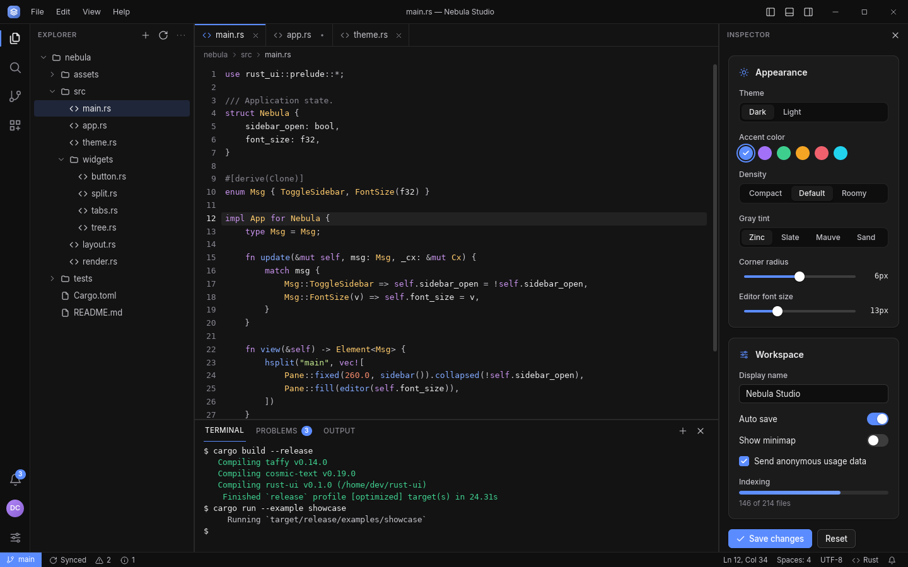

**What you get**

- **Web-like looks out of the box.** CSS-style flexbox and grid layout (via [taffy]), per-corner
  radii, layered *blurred* box shadows, linear gradients, opacity, outlines/focus rings, and the
  [Inter] font bundled so text looks the same everywhere.
- **Customizability first.** Every widget is an ordinary `Element` you can restyle with chainable
  builder methods. All built-in widgets read their colors, radii and sizes from a `Theme`. You can swap
  or tweak the theme at runtime (dark, light, any accent).
- **IDE-grade panels.** `hsplit`/`vsplit` panes with draggable splitters, min/max sizes, fixed or
  proportional sizing, and animated slide-to-collapse, nested in any direction. Drag a splitter
  past half the minimum to collapse a pane (VS Code style). Double-click a splitter to reset it.
- **Drag-and-drop docking.** `Dock` lets users drag tabs between panel groups or onto an edge to
  split it left/right/top/bottom, with live drop previews and a Visual Studio-style compass.
  Tabs have context menus, panels can move into their own windows, and named layouts save and
  restore whole arrangements.
- **Electron-style chrome.** Frameless windows with custom title bars, window controls,
  edge-resizing, menu bars with dropdowns, context menus, modals and tooltips.
- **Smooth.** CSS-like `transition`s for hover, press, focus and any style change. Smooth wheel
  scrolling with auto-hiding overlay scrollbars.
- **Testable.** A headless runtime drives apps without a window: simulate clicks, drags and typing,
  then assert on layout or save PNG screenshots. Every screenshot here was rendered that way.

| Light theme | Drag-and-drop docking |
|---|---|
| 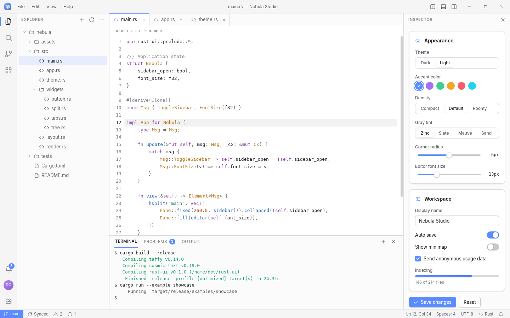 | 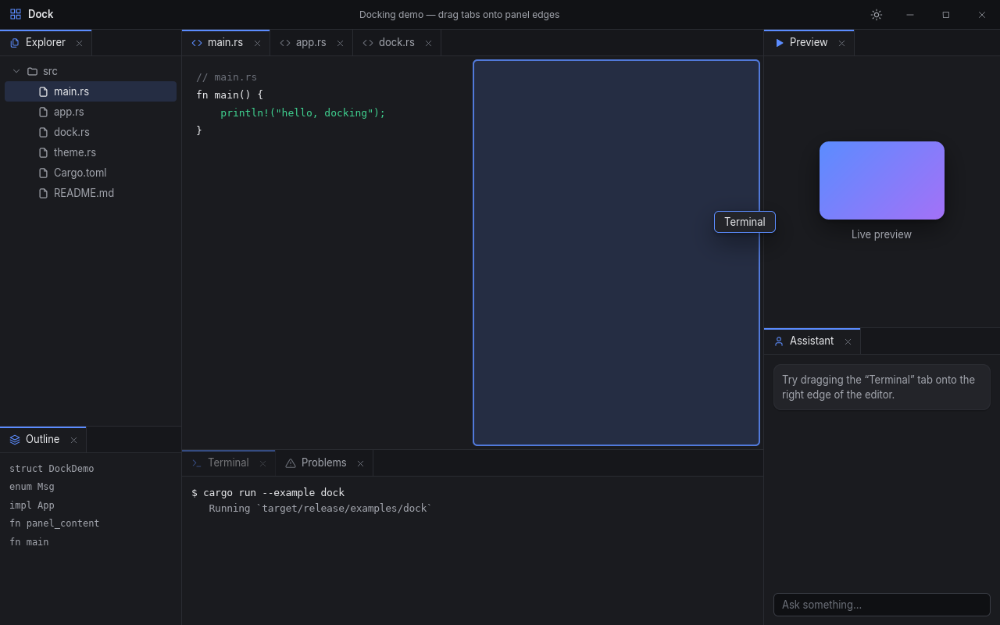 |

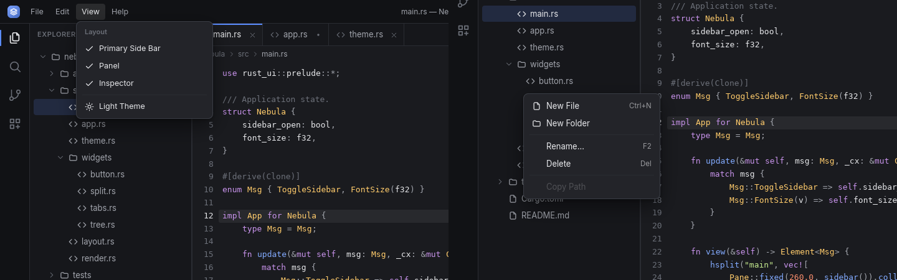

## Quick start

```rust
use rust_ui::prelude::*;

struct Counter { n: i32 }

#[derive(Clone)]
enum Msg { Inc, Dec }

impl App for Counter {
    type Msg = Msg;

    fn update(&mut self, msg: Msg, _cx: &mut Cx) {
        match msg { Msg::Inc => self.n += 1, Msg::Dec => self.n -= 1 }
    }

    fn view(&self) -> Element<Msg> {
        col().size_full().center().gap(12.0)
            .child(text(self.n.to_string()).font_size(48.0).bold())
            .child(row().gap(8.0)
                .child(button("−").on_click(Msg::Dec))
                .child(primary_button("+").on_click(Msg::Inc)))
    }
}

fn main() {
    rust_ui::run(Counter { n: 0 }, WindowOptions::new("Counter")).unwrap();
}
```

```sh
cargo run --release --example gallery    # every widget, one page each
cargo run --release --example showcase   # the IDE shell in the screenshots
cargo run --release --example dock       # drag-and-drop docking
cargo run --release --example counter    # the minimal app above
```

On Linux you need the usual X11/Wayland runtime libraries (e.g. `libxkbcommon-x11`).

To start a new app from a template (see [`templates/`](templates/README.md)):

```sh
cargo generate --git https://github.com/cochbild/rust-ui templates/ide-shell --name my-ide
cargo generate --git https://github.com/cochbild/rust-ui templates/settings-app --name my-settings
```

## Documentation

- **The book** (`book/`, built with [mdBook](https://rust-lang.github.io/mdBook/): `mdbook serve
  book`) is the guide: getting started, the app model, layout, styling, theming, panels,
  commands, windows, testing and performance. Its examples run as doc tests.
- **The API reference:** `cargo doc --open`. Every public item is documented.
- **Deeper notes** in `docs/`: [customizing](docs/CUSTOMIZING.md),
  [performance](docs/PERFORMANCE.md), [coming from iced](docs/FROM_ICED.md) and the
  [versioning policy](docs/SEMVER.md).

## Concepts

### The app model

Apps follow the Elm/React pattern: state lives in your struct, `view` describes the UI for the
current state, and user interaction produces messages handled by `update`. The runtime only
rebuilds when something changed. It keeps UI-only state (scroll offsets, splitter positions, text
cursors, animations) keyed by element identity, so your model stays clean.

Give elements stable identity with `.id("name")` or `.key(value)` when they can move around.

**Components** keep their own state when the app doesn't need it: whether a section is open, a
picker's visible month, a filter box's text. A component handles its own events and sends the
app a message only when the app needs to know something:

```rust
impl Component for Folder {
    type State = bool;       // open?
    type Event = FolderEv;   // Toggle, Open(i)
    type Output = Msg;       // what the app sees
    fn update(&self, open: &mut bool, e: FolderEv) -> Option<Msg> { … }
    fn view(&self, open: &bool) -> Element<FolderEv> { … }
}

list.child(component(("folder", name), Folder { name, items }))
```

For one-off cases, `stateful(key, view, update)` takes closures instead. Components nest, and
their state lasts as long as they are rendered.

**Multiple windows** are declared from state, like the rest of the UI. The app lists its extra
windows in `windows()` and draws them in `window_view(key)`:
- a window opens when its key appears and closes when it disappears;
- closing one sends its `on_close` message;
- every window shares the same app, so an update from any window re-renders them all;
- each window keeps its own hover, focus and scroll state.

```rust
fn windows(&self) -> Vec<WindowSpec<Msg>> {
    self.inspectors.iter().map(|&i| {
        WindowSpec::new(format!("inspector-{i}"), format!("Inspector {i}"), Msg::Close(i)).size(320.0, 220.0)
    }).collect()
}
fn window_view(&self, key: &str) -> Element<Msg> { … }
```

`HeadlessApp` drives multi-window apps in tests (see `examples/multiwindow.rs`).

**Memoization:** `lazy(key, deps, || view)` skips rebuilding a part of the UI while `deps` are
unchanged (see [`docs/PERFORMANCE.md`](docs/PERFORMANCE.md)).

### Styling

Builder methods mirror CSS:

```rust
row()
    .items_center().gap(8.0).px(12.0).h(32.0)
    .bg(hex("#1e1f24"))
    .border(1.0, hex("#2f3138"))
    .rounded(8.0)
    .shadow(Shadow::new(0.0, 4.0, 12.0, 0.0, Color::BLACK.with_alpha(0.3)))
    .gradient(135.0, [(0.0, hex("#5b8cff")), (1.0, hex("#a371f7"))])
    .transition(0.15)                                  // animate state changes
    .hover(|s| s.bg(hex("#26282e")).translate(0.0, -1.0))
    .active(|s| s.bg(hex("#2c2e35")))
    .focus_style(|s| s.outline(2.0, 2.0, hex("#5b8cff")))
```

Supported: flex (direction, wrap, grow/shrink/basis, justify, align, gap), grid (fr/px/%/auto
tracks, spans), width/height/min/max, padding, margin (including `auto`), absolute and fixed
positioning with z-index (overlays escape clipping), overflow hidden and scroll, per-side borders,
per-corner radii, multiple blurred shadows, gradients, opacity, outlines, translate, cursors,
fonts (family, size, weight, italic, line height, letter spacing), text alignment, wrapping and
`…` ellipsis. Text properties inherit like CSS.

Use `.apply(fn)` and `.when(cond, fn)` for reusable style mixins.

### Themes

See [`docs/CUSTOMIZING.md`](docs/CUSTOMIZING.md) for the full set of customization layers, from
theme settings down to custom drawing, and [`docs/PERFORMANCE.md`](docs/PERFORMANCE.md) for
scaling numbers and guidelines.

Themes are organized like modern web design systems (Radix Colors / shadcn/ui):

1. **Primitive scales**: 12-step OKLCH color scales generated from a seed color.
   Steps 1–2 are app backgrounds, 3–5 component states, 6–8 borders, 9–10 solid fills,
   and 11–12 text.
2. **Semantic roles**: `theme().colors.surface`, `.border`, `.text_muted`, `.accent`,
   `.focus_ring` and so on, derived from the scales. Widgets only use these roles.
3. **A few global knobs** that regenerate everything consistently:

```rust
fn theme(&self) -> Theme {
    Theme::from_config(ThemeConfig {
        accent: hex("#a371f7"),
        gray: GrayTint::Mauve,        // Zinc, Slate, Sand, Sage, Accent, Custom { hue, chroma }…
        radius: 8.0,                  // sm = ×0.6, lg = ×1.6
        scaling: 1.0,                 // text and control size multiplier
        density: Density::Compact,    // control, row and tab heights
        ..ThemeConfig::dark()
    })
}
```

Any `Color` works as the accent. There are also 16 named presets (`Accent::ALL`, e.g.
`Accent::Teal.color(dark)`) for building pickers with `color_swatch`. Because `theme()` is
re-read every frame, a settings screen can change any knob live. `examples/lmfast_chat.rs`
has one (Settings → Appearance).

Button text on the accent stays white unless that falls below WCAG's 3:1, e.g. on orange,
amber or lime; then it switches to near-black. A test checks every preset in both modes.

**Style classes** restyle every instance of a built-in widget from the theme, like CSS classes:

```rust
Theme::dark()
    .style_class("button", |e| e.pill().px(18.0))
    .style_class("input", |e| e.rounded(0.0))
```

Built-in widgets tag themselves (`button`, `button-primary`, `input`, `tab-active`,
`table-row`, …). Your own elements can use `.class("name")`. Precedence works like CSS: widget
defaults, then theme classes, then the app's own styling on the element.

Every token on the resulting `Theme` is public, so you can still override single values.
The raw scales are there for your own components: `theme().scales.accent.step(3)`.

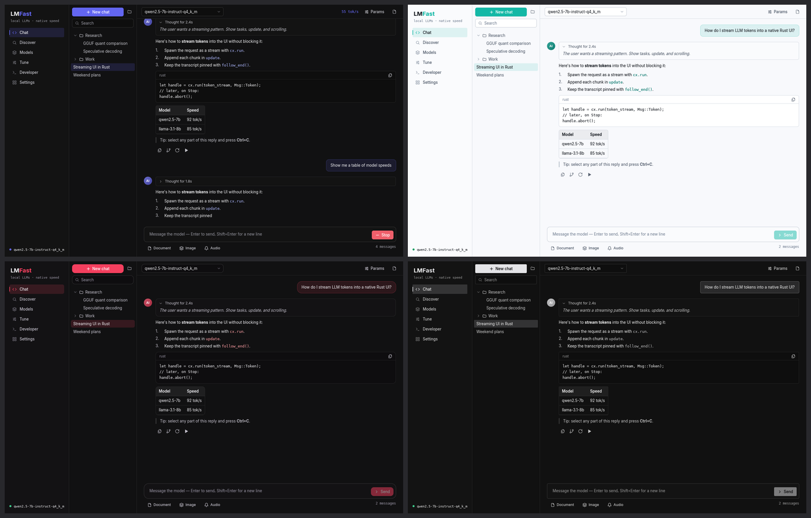

Defaults follow web conventions:
- 13px UI text and a 4px spacing rhythm.
- Transitions of 150ms using the standard curve `cubic-bezier(.4,0,.2,1)`. Use
  `.easing(..)` for any CSS curve.
- Two-layer soft shadows.
- Translucent borders in dark mode.
- Focus rings shown only for keyboard focus (3px ring, like `:focus-visible`).
- Splitters highlight after a 300ms hover delay, as in VS Code.

### Split panes

```rust
hsplit("main", vec![
    Pane::fixed(260.0, sidebar).min(170.0).max(520.0)
        .collapsible(true).collapsed(!self.sidebar_open),   // animated slide
    Pane::fill(vsplit("center", vec![
        Pane::fill(editor),
        Pane::fixed(220.0, terminal).collapsible(true).collapsed(!self.panel_open),
    ])),
    Pane::flex(0.5, inspector),                            // proportional share
])
.on_collapse(|pane, collapsed| Msg::Collapsed(pane, collapsed))  // drag-to-collapse
.on_resize(Msg::SaveLayout)                                      // persist sizes
```

- **Priorities** (VS Code's `LayoutPriority`): when the window gets too small for every pane,
  fixed panes shrink (down to their minimum) `Priority::High` first and `Priority::Low` last;
  with no flex pane to fill extra room, it goes to the highest priority. Each pane keeps its own
  size and returns to it when there's room again.

  ```rust
  Pane::fixed(260.0, sidebar).priority(Priority::Low)   // keeps its width longest
  ```
- **Remembered sizes:** `Pane::key("terminal")` gives a pane that comes and goes (a toggled
  panel) its last size back, and keeps its content's state while other panes change.
- **Keyboard:** Tab to a splitter, then the arrow keys (Shift for bigger steps), Home and End.

### Docking

```rust
let dock = Dock::new(DockNode::hsplit(vec![
    (1.0, DockNode::tabs(vec![Panel::Explorer])),
    (3.0, DockNode::vsplit(vec![
        (3.0, DockNode::tabs(vec![Panel::Editor("main.rs"), Panel::Editor("lib.rs")])),
        (1.0, DockNode::tabs(vec![Panel::Terminal])),
    ])),
]));

// update: Msg::Dock(m) => self.dock.update(m)
// view:   self.dock.view("dock", |p| p.title(), |p| p.content(), Msg::Dock)
```

What users can do:
- Drag a tab onto another group's body to join it.
- Drag a tab onto a group's edge (VS Code-style zones) to split it. The drop preview slides
  between zones.
- Or aim with the **compass**: while dragging, a cross of targets appears in the middle of the
  hovered group (join, or split left/right/top/bottom), and guides at the dock's outer edges add a
  full-height or full-width panel along that edge. Turn it off with `dock.compass = false`.
- Drag a tab along a tab strip to reorder it, with an insertion marker.
- Double-click a tab, or use the header button, to maximize a group and restore it.
- Resize every split. Sizes are proportional and are written back into the layout tree.
- Close tabs. Empty groups disappear.
- Right-click a tab (or press Shift+F10 on it) for its commands: Close, Close Others, Close All
  in Group, Split Right / Down, Move to Edge ▸, Open in New Window / Dock Back, Maximize.
- Resize splitters from the keyboard: Tab to one, then the arrow keys (Shift for bigger steps),
  Home and End.

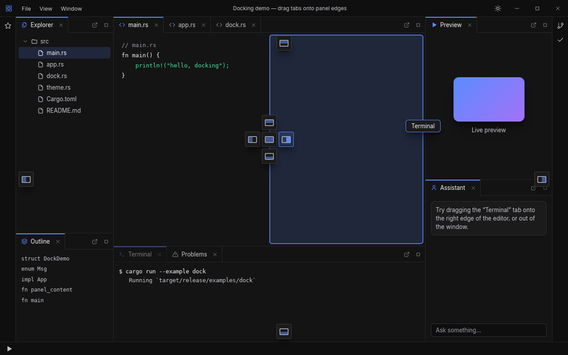

**Tabs in their own windows.** Wrap the dock in a `DockSpace` and return its `windows()` from
`App::windows`. Users can then:
- drag a tab out of the window, which opens it in a new OS window where it was dropped;
- drag it onto any group in another window to dock it there, with the same edge and center
  previews;
- use the header buttons "Open in new window" and "Dock back", which also work for keyboard
  users and on Wayland (where a window can't learn its screen position).

Closing a floating window docks its tabs back.

```rust
// update:      Msg::Dock(m) => self.dock.update(m)
// view:        self.dock.view(None, title, content, Msg::Dock)
// windows:     self.dock.windows(title, Msg::Dock)
// window_view: self.dock.view(Some(key), title, content, Msg::Dock)
```

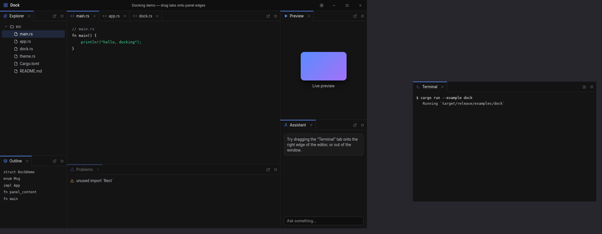

**Tool windows** (`ToolWindows`) add JetBrains-style side panels around any content, such as a
dock:
- icon stripes on the left, right and bottom edges, one button per tool window;
- a *pinned* tool window takes space, with a splitter to resize it;
- an *auto-hide* one slides over the content, and hides again when you click elsewhere, press
  Escape or click its stripe button;
- one tool window per edge is open at a time;
- the header's pin button switches modes, and the minus button hides the panel.

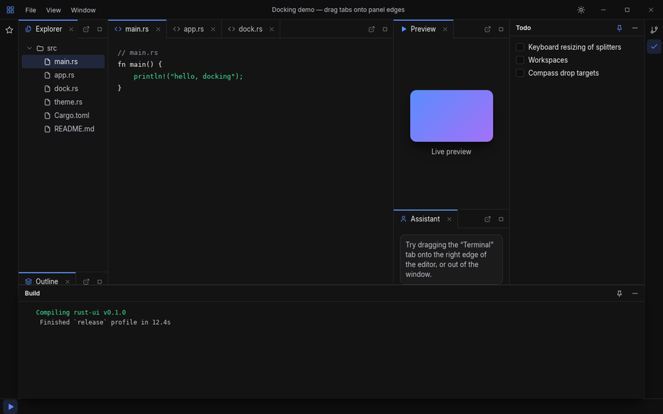

Right-click a tool window's stripe button or header (or use its ⋯ button) to move it to another
edge, switch between pinned and auto-hide, or hide it.

**Named layouts** (`Layouts<S>`) keep snapshots of any arrangement under a name, like JetBrains
layouts or Visual Studio window layouts. `S` is usually your dock plus tool windows:

```rust
#[derive(Clone)]
struct Workspace { dock: DockSpace<Panel>, tools: ToolWindows<Tool> }

let layouts = Layouts::new().with("Default", default()).with("Debug", debug());
// update:  if let Some(w) = self.layouts.update(m, &self.workspace()) { self.set_workspace(w) }
// menu:    MenuItem::submenu("Layouts", self.layouts.menu_items(&Msg::Layout))
// view:    .children(self.layouts.dialog(Msg::Layout))   // "Save Layout As" dialog
```

The menu lists the layouts (the current one checked), "Save Changes to …", "Save Layout As…" and
"Delete Layout ▸". Applying a layout replaces the arrangement, floating windows included.

With the `serde` feature, the whole `Dock` or `DockSpace` (tree, weights, tabs, maximized group,
floating windows, and a `version` field), `ToolWindows` and `Layouts` serialize, so layouts can
be persisted across runs.

Any element can animate its layout changes with `.animate_layout(secs)` (FLIP-style), which is
useful for indicators, previews and reordering.

### Widgets

`button`, `primary_button`, `ghost_button`, `danger_button`, `icon_button`, `text_input`
(selection, word navigation, clipboard, undo/redo, IME composition, password mode), `text_area`, `search_input`, `checkbox`, `switch`,
`radio_group`, `number_input`, `image` and `svg` (with `.fit(Fit::Cover)`, `.rounded()`,
`.tint()`), `slider`, `progress`, `segmented`, `tab_bar`, `tree_row`/`list_item`, `menu_bar`, `menu_panel`,
`context_menu`, `modal`, `backdrop`, `titlebar`, `window_controls`, `status_bar`/`status_item`,
`card`, `badge`, `tag`, `kbd`, `avatar`, `section_header`, `separator`, and `.tooltip(..)` on any
element.

`virtual_list(count, |i| row)` scrolls through 100k+ rows while building only the rows near the
viewport. Rows can have different heights: each one is measured the first time it's shown, and
the scroll position stays anchored while estimates are replaced by real heights. It supports
`.follow_end()`, `.on_scroll()`, `cx.scroll_to_end(id)` and `cx.scroll_to_item(id, i)`. A frame
with 200k rows costs about the same as one with 100.

**Trees** of any size: implement `TreeModel` for your data (children are asked for only when a
node is expanded, so it can load lazily), keep a `TreeState`, and call
`tree.view(&model, Msg::Tree)`. It builds only the rows on screen, like `virtual_list`. It has
indent guides, chevrons that toggle, and double-click to open. The keyboard works like VS Code's
explorer: ↑/↓, → to expand or go to the first child, ← to collapse or go to the parent,
Home/End, PageUp/PageDown, Enter, Space, and type-ahead. `tree.update(msg, &model, cx)` reports
`Selected`, `Activated`, `Expanded` and `Collapsed`, and scrolls the selection into view.

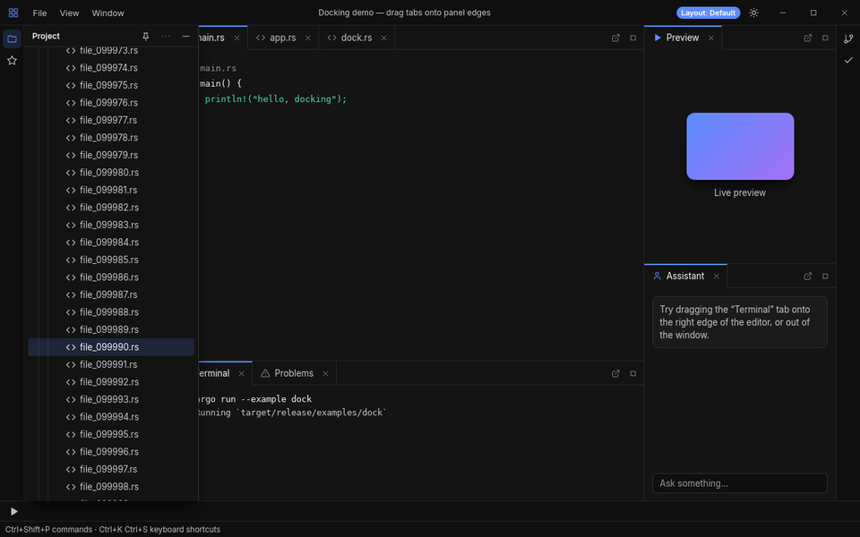

`table(id, columns, rows, |row, col| cell)` is a data grid. It supports fixed and weighted
columns (`Column::new("Size").fixed(90.0).align_end().sortable()`), a header that stays put with
sort indicators, and a virtualized body. Rows are clickable and can be selected and striped, and
there's an empty state. Users can resize columns by dragging the header dividers (double-click
resets). The runtime keeps those widths, so the app needs no state for them. Read or restore
them with `Runtime::column_widths`.

Icons are crisp vectors. There's a built-in set, and any 24×24 SVG path works via
`Icon::svg("M…")`, so you can paste in Lucide or Feather icons. For fully custom drawing, use
`canvas(|cv, rect| …)`.

### Accessibility

Screen readers work through [AccessKit](https://accesskit.dev): UI Automation on Windows (Narrator,
NVDA, JAWS), NSAccessibility on macOS (VoiceOver) and AT-SPI on Linux (Orca). Built-in widgets
expose their role, name and state: a checkbox is a checked or unchecked "Remember me" check box,
a slider has its value and range, and a dialog is modal. Text inside a button becomes the
button's name rather than a separate node, and icon-only buttons are named by their tooltip.
Screen-reader actions (activate, focus, set value, increment, scroll) run through the same code
as mouse and keyboard input.

Custom widgets use ARIA-style methods:

```rust
div().role(Role::Switch).aria_checked(on).aria_label("Wi-Fi").on_click(Msg::ToggleWifi)
```

`Runtime::accessibility_tree()` returns the tree, so tests can assert on it headlessly.

**High contrast.** `ThemeConfig { contrast: Contrast::High, .. }` (or `.with_contrast(…)`)
derives a high-contrast version of any theme, in the style of Windows contrast themes:
- near-black or white surfaces;
- opaque borders, and no shadows;
- text at 7:1 contrast, and accents and state colors at 4.5:1 or more.

Tests check these ratios for every accent, gray tint and mode. `system_prefs().high_contrast`
reports the OS setting, so apps can follow it.

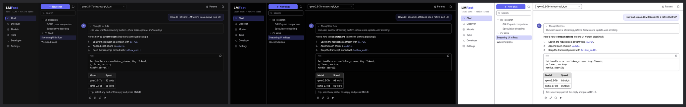

**Reduced motion.** The runtime follows the OS setting ("Animation effects" on Windows, "Reduce
motion" on macOS, "Animations" on GNOME):
- smooth scrolling, pane slides, layout animations and `translate` transitions become instant;
- color and opacity fades still fade.

`anim::reduced_motion()` lets custom animations check the setting, and `set_reduced_motion`
overrides it from an in-app setting.

### Custom window chrome

```rust
rust_ui::run(app, WindowOptions::new("My App").frameless(true))
// in view:
titlebar(title, left_content, right_content, window_info().maximized)
```

Any element can become a drag area (`.window_drag_area()`) or a window button
(`.window_control(WindowControl::Close)`). Frameless windows stay resizable from their edges.

Per platform:
- **Windows:** frameless windows keep Snap Layouts, the shadow and rounded corners.
  `WindowOptions::backdrop(Backdrop::Mica)` (or `Acrylic`, `Tabbed`) puts the Windows 11 material
  behind the window. The title bar and tool-window stripes show it, and anything painted with a
  transparent or translucent color does too. It needs the GPU renderer; without one, the window
  opens without the backdrop.
- **macOS:** a frameless window keeps its traffic lights over the app's title bar (transparent,
  full-size content), with native resizing and full screen. `titlebar()` leaves room for them
  and draws no buttons of its own. Move them with `.traffic_lights(x, y)`. Text fields use the
  macOS editing keys (Cmd+←/→, Cmd+⌫, Option for words), and the menu bar gets the standard
  Window items (Minimize, Zoom, Enter Full Screen, Close).
- **Linux:** winit negotiates server-side decorations and draws client-side ones on GNOME
  Wayland, which now follow the app's light or dark theme. Frameless windows resize from their
  edges on X11 and Wayland.
- **Full screen:** `cx.toggle_fullscreen()` (the native full-screen Space on macOS).
- **Scaling:** moving to a monitor with another scale re-lays out and re-rasterizes text and
  icons for it. At fractional scales (125 %, 150 %), square fills and borders snap to device
  pixels, so 1 px lines stay sharp.
- **System font:** `WindowOptions::system_font(true)` uses the platform's UI font (Segoe UI
  Variable, SF Pro, or the desktop's font on Linux) instead of the bundled Inter.

`window_info()` tells views about the window: `maximized`, `focused`, `fullscreen`,
`native_buttons` and `buttons_inset`, `backdrop`, and `scale`.

### App menus and shortcuts

Declare the menus once, from state:

```rust
fn menu(&self) -> Vec<Menu<Msg>> {
    vec![
        Menu::new("File", vec![
            MenuItem::action("Open…", Msg::Open).shortcut("Mod+O"), // Cmd on macOS, Ctrl elsewhere
            MenuItem::submenu("Export", vec![MenuItem::action("HTML", Msg::ExportHtml)]),
        ]),
        Menu::new("View", vec![MenuItem::check("Word wrap", self.wrap, Msg::ToggleWrap).shortcut("Alt+Z")]),
    ]
}
```

- **Shortcuts** work in every window. A focused text input keeps its own editing keys, so Ctrl+C
  in a text field copies rather than triggering the menu's Copy.
- **In the window:** `menubar(self.menu())` draws the menu bar (in a custom title bar, for
  example), with submenus.
- **Native menu bar:** on macOS the same menus become the global menu bar, with the standard app
  menu and native key equivalents, and `menubar()` then renders nothing. Windows can opt into a
  native menu bar with `WindowOptions::native_menu(true)`.

### Commands and key bindings

For an app with many actions, declare them as **commands**: an id, a title, a message and default
keys. Users can then search them, run them, and rebind them.

```rust
fn commands(&self) -> Commands<Msg> {
    Commands::new(vec![
        Command::new("file.save", "Save", Msg::Save).category("File").key("Mod+S"),
        Command::new("prefs.keys", "Keyboard Shortcuts", Msg::ShowKeys).key("Mod+K Mod+S"), // a chord
        Command::new("view.wrap", "Word Wrap", Msg::ToggleWrap).key("Alt+Z").checked(self.wrap),
    ])
    .with_keymap(&self.keymap) // the user's overrides
}
fn menu(&self) -> Vec<Menu<Msg>> {
    let c = self.commands();
    vec![Menu::new("File", vec![c.menu_item("file.save")])] // title, key and state from the command
}
```

- **Keys** work in every window, like menu shortcuts. Two-stroke chords such as `Ctrl+K Ctrl+S`
  are supported; `commands::pending_chord()` says when the first stroke is waiting, for a status
  bar hint.
- **`CommandPalette`** lists every command with its key (VS Code's Ctrl+Shift+P): type to
  filter, ↑/↓ and Enter to run.
- **`KeymapEditor`** is a Keyboard Shortcuts screen: search, record a new binding (chords too),
  reset or remove one. It warns about conflicts. It edits a `Keymap`, which serializes with the
  `serde` feature.
- **Focus panel N:** `dock.focus_id(n)` gives the element to pass to `cx.focus()`.

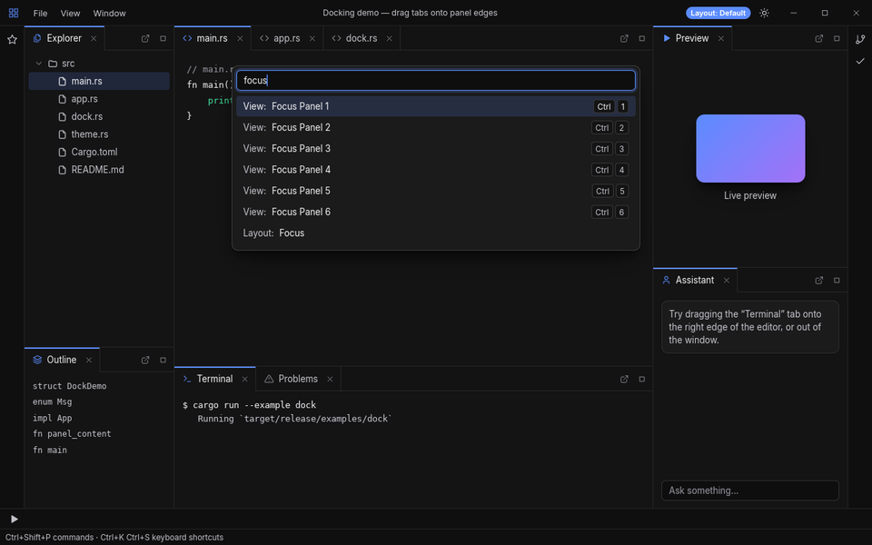

### File dialogs

Ask from `update`; the answer arrives as a message, so nothing blocks:

```rust
Msg::Open => cx.open_file(FileDialog::new().filter("GGUF models", &["gguf"]), Msg::Opened),
Msg::Opened(Some(path)) => { /* load */ }
Msg::Opened(None) => {} // cancelled
```

`open_files`, `pick_folder` and `save_file` work the same way. The native dialog is modal to the
window that asked:
- **Windows:** the common item dialog;
- **macOS:** the system panels;
- **Linux:** the XDG desktop portal, falling back to zenity.

Headless tests script the user's choice with `Runtime::set_dialog_responder`.

### Headless testing and screenshots

```rust
let mut h = Headless::new(MyApp::default(), 1280.0, 800.0, 2.0);
h.click(100.0, 40.0);
h.drag((260.0, 300.0), (400.0, 300.0), 8);
h.type_text("hello");
assert_eq!(h.rt.app.query, "hello");
h.save_png("shot.png")?;
```

## Architecture

| Layer | Crate / module |
|---|---|
| Declarative tree + builders | `element`, `widgets`, `dock` |
| Layout (flexbox/grid) | [taffy] |
| Text shaping and rasterization | [cosmic-text] + swash, Inter bundled |
| Display list | `scene`: each frame is recorded once, then handed to a backend |
| **GPU backend** (default) | `gpu`: wgpu. The whole frame is one instanced draw call, with SDF rounded rects and borders, analytic Gaussian shadows, and glyph/path atlases |
| CPU backend (fallback, tests) | `cpu`: tiny-skia with bounded scratch buffers for clipping and layers |
| Runtime: retained state, events, hit-testing, focus, drag and drop, animations | `runtime` |
| Windowing | winit, with wgpu surfaces or softbuffer; clipboard via arboard |

**Text quality.** Glyph coverage gets DirectWrite-style contrast enhancement and gamma correction,
the same approach Windows Terminal and Zed use to match browser and native text. Baselines are
snapped to the pixel grid. Both backends apply identical correction, and a test keeps the GPU
output matching the CPU reference.

**Choosing a renderer.** The GPU backend is used when an adapter is available (Vulkan, Metal, DX12
or GL). Otherwise the app falls back to the CPU backend. Set `RUI_RENDERER=cpu` to force the CPU,
or build without the `gpu` feature. Set `RUI_PROFILE=1` to print the chosen adapter and per-frame
timings.

**Performance.** On the CPU backend, a full 1440×900 IDE frame (about 600 elements) takes about
10 ms at 1× and about 20 ms at 2× on one core. On the GPU backend, the CPU side of a frame is layout
(about 5 ms) plus recording (about 0.4 ms), and the GPU draws everything in one call.

## Status and roadmap

This is a working 0.x framework heading for 1.0. The API may still change between minor
releases; [`docs/SEMVER.md`](docs/SEMVER.md) says what's covered and how breaks are announced,
and [`CHANGELOG.md`](CHANGELOG.md) lists them. The plan to 1.0 is in
[`docs/ROADMAP.md`](docs/ROADMAP.md). The main gaps are QA on real Windows and macOS hardware,
CI, and a published crate name.

See [`docs/LANDSCAPE.md`](docs/LANDSCAPE.md) for the survey of existing Rust UI frameworks and
the design research behind these choices.

## Contributing

See [`CONTRIBUTING.md`](CONTRIBUTING.md) for how to build, test and submit changes, and
[`CODE_OF_CONDUCT.md`](CODE_OF_CONDUCT.md) for the community standards.

## License

MIT OR Apache-2.0. The bundled Inter font is under the SIL Open Font License
(`assets/fonts/Inter-LICENSE.txt`).

[taffy]: https://github.com/DioxusLabs/taffy
[cosmic-text]: https://github.com/pop-os/cosmic-text
[tiny-skia]: https://github.com/RazrFalcon/tiny-skia
[Inter]: https://rsms.me/inter/
