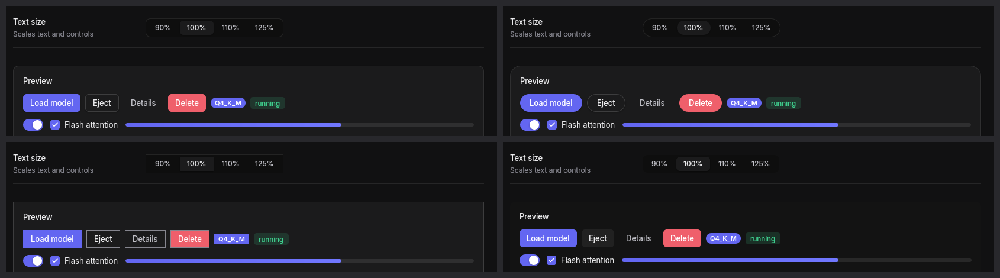

# Customizing

Customization works in layers. Each layer is optional, and each one overrides the layer above it.
Start at the top and go down only as far as you need.

| Layer | What it changes | Where |
|---|---|---|
| 1. Knobs | The whole palette, radii, sizes and density, from a few settings | `ThemeConfig` |
| 2. Tokens | Any single color, radius, size, shadow or timing | fields of `Theme` |
| 3. Style classes | Every instance of a built-in widget, or your own named styles | `Theme::style_class` |
| 4. Instance styling | One element | builder methods on `Element` |
| 5. Composition | New widgets built from elements | plain functions |
| 6. Drawing | Anything elements can't express | `canvas`, `Icon::svg`, fonts |

A color, size or shape is never hard-coded in a way you can't reach: every built-in widget reads
tokens and tags itself with classes.

## 1. Knobs

```rust
fn theme(&self) -> Theme {
    Theme::from_config(ThemeConfig {
        dark: true,
        accent: Accent::Teal.color(true), // or any Color: hex("#0ea5e9")
        gray: GrayTint::Slate,            // Zinc, Gray, Mauve, Sand, Sage, Accent, Custom { hue, chroma }
        radius: 8.0,
        scaling: 1.1,
        density: Density::Compact,
        font: FontFamily::Named("Geist".into()),
        ..ThemeConfig::dark()
    })
}
```

- `theme()` is called every frame, so settings screens can change knobs live. The lmfast demo's
  Settings → Appearance screen does this.
- Each color becomes a 12-step OKLCH scale (Radix-style), and the semantic palette is derived
  from those scales.
- Button text on the accent automatically stays readable (WCAG contrast).

## 2. Tokens

Every field of `Theme` is public:
- `colors` (surface, panel, border, text_muted, accent, code_text, …);
- `radius_sm`, `radius`, `radius_lg`;
- `font_size`, `control_height`, `row_height`, `tab_height`, `titlebar_height`;
- `shadow_sm` and `shadow_popover`;
- `transition` and `easing`;
- `focus_ring_width` and `splitter_hover_delay`.

Override any of them after generating the theme:

```rust
let mut t = Theme::from_config(cfg);
t.colors.background = hex("#0b0b0e");
t.shadow_popover.clear();
t.transition = 0.1;
```

## 3. Style classes

Style classes work like CSS classes. Every built-in widget tags itself with class names, so a
theme can restyle all buttons, inputs or tabs at once, with the same builder methods you use
anywhere else:

```rust
Theme::dark()
    .style_class("button", |e| e.pill().px(18.0))
    .style_class("button-primary", |e| e.shadow(glow()).hover(|s| s.bg(hex("#6d5dfc"))))
    .style_class("input", |e| e.rounded(0.0).border(0.0, Color::TRANSPARENT).bg(theme().colors.hover))
    .style_class("card", |e| e.rounded(16.0).no_shadow())
```

**Precedence** works like CSS:
1. the widget's defaults;
2. then the theme's classes, in the order the widget applies them (e.g. `button`, then
   `button-primary`);
3. then whatever the app chains on that element (`primary_button("Go").px(4.0)` stays narrow
   under the pill class above).

**Scope:**
- Class functions can read tokens with `theme()`, and can set state styles (`hover`, `active`,
  `focus_style`, `disabled_style`).
- Children added by a class function are ignored.
- Changing knobs with `with_accent`, `with_dark`, … keeps the classes.

**Your own classes:** tag any element with `.class("sidebar")` and define `sidebar` in the theme.
Unknown class names do nothing, so it's safe to tag elements before any theme defines them.

**Cost:** zero when a theme defines no classes; otherwise one lookup per tagged element.

### Built-in class names

| Widget | Classes |
|---|---|
| Buttons | `button`, plus one of `button-primary`, `button-secondary`, `button-ghost`, `button-danger` |
| Icon button | `icon-button` |
| Text input, search | `input`, `search-input` |
| Text area | `input`, `text-area` |
| Checkbox | `checkbox`, and on its box `checkbox-box`, `checkbox-box-checked` |
| Switch | `switch`, `switch-on`, and `switch-thumb` on the knob |
| Slider, progress | `slider`, `progress` |
| Badge, tag, kbd, avatar | `badge`, `tag`, `kbd`, `avatar` |
| Card, separator, section header | `card`, `separator`, `section-header` |
| Tree and list rows | `tree-row`, `tree-row-selected`, `list-item` |
| Tabs | `tab-bar`, `tab`, `tab-active` |
| Segmented control, swatches | `segmented`, `segmented-item`, `segmented-item-active`, `color-swatch` |
| Menus | `menu`, `menu-item`, `menu-bar`, `menu-bar-item` |
| Dialog | `modal` |
| Status bar | `status-bar`, `status-item` |
| Window chrome | `titlebar`, `window-controls` |
| Table | `table`, `table-header`, `table-header-cell`, `table-row`, `table-row-selected`, `table-cell` |



The lmfast demo's **Style** setting (Default, Pill, Sharp, Flat) is a few lines of classes per
preset (`StylePreset::apply` in `examples/lmfast_chat.rs`).

## 4. Instance styling

Any element takes CSS-like builder methods:
- **Layout:** `row`, `col`, `grid`, `gap`, `p`, `w`, `grow`, `absolute`, `z_index`, …
- **Visuals:** `bg`, `gradient`, `border`, `rounded`, `shadow`, `opacity`, `outline`, `translate`.
- **Text:** `font_size`, `bold`, `mono`, `letter_spacing`, `ellipsis`.
- **States:** `hover`, `active`, `focus_style`, `disabled_style`.
- **Motion:** `transition`, `easing`, `animate_layout`.

These apply after classes.

## 5. Composition

Widgets are plain functions that return `Element`s, and so are yours:

```rust
fn stat<M: 'static>(label: &str, value: String) -> Element<M> {
    let th = theme();
    card().gap(4.0)
        .child(text(label).font_size(th.font_size_sm).color(th.colors.text_muted))
        .child(text(value).font_size(24.0).bold())
        .class("stat") // lets themes restyle it too
}
```

- Use `Element::map` to embed a component that has its own message type.
- For accessibility, give custom controls a role and state: `.role(Role::Switch)`,
  `.aria_checked(on)`, `.aria_label("Wi-Fi")`, `.focusable()`.

## 6. Drawing, icons and fonts

- **Drawing:** `canvas(|cv, rect| …)` draws with rounded rectangles, paths, gradients, text and
  shadows, on the same GPU or CPU renderer as everything else.
- **Icons:** `Icon::svg("M…")` takes any 24×24 SVG path, e.g. from Lucide or Feather.
- **Fonts:** `WindowOptions::new("App").font(include_bytes!("Geist.ttf").to_vec())` loads a font,
  which you then use by name with `FontFamily::Named("Geist".into())`. Headless and tests use
  `Runtime::load_font`.
