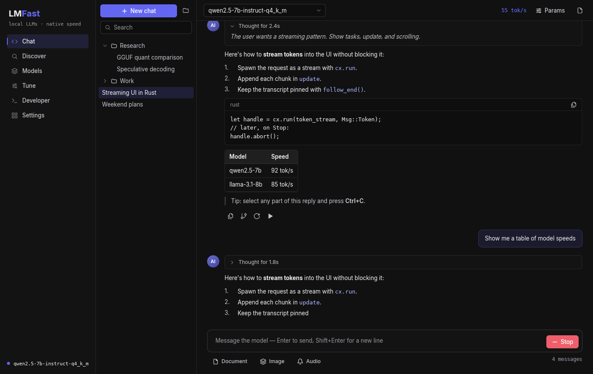
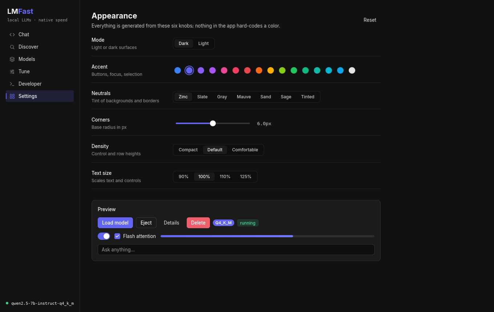
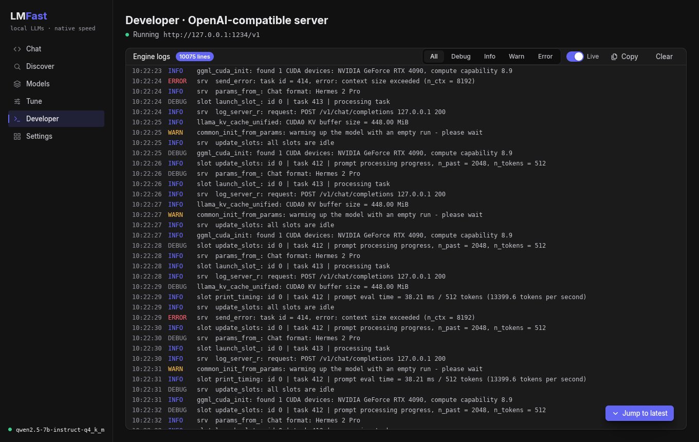

# Porting lmfast-rs (iced 0.13) to this framework

lmfast-rs is an LM Studio-style local LLM desktop app (`cochbild/lmfast-rs`, crate `lmfast-ui`).
It is the first real app this framework must carry with **no loss of function**. That is the
concrete test of "production ready".

The inventory below comes from reading lmfast-ui: about 13k lines of UI across 6 screens (Chat,
Discover, Models, Tune, Developer, Settings).

## What the app relies on

**Async**
- About 25 `Task::perform` calls: Hugging Face API requests, folder scans, rfd file dialogs, VRAM
  sampling.
- Streams via `Task::stream` / `Task::run`, with abort handles:
  - chat token streaming;
  - download progress (pause and resume);
  - long tuning sweeps.

**Subscriptions**
- `window::close_requests()`: save, shut the engine down, then exit.
- `window::resize_events()`: persist the window size.
- A conditional 1s `time::every` tick.

**Text**
- A multi-line composer: Enter sends, Shift+Enter adds a newline.
- System-prompt and edit-message editors.
- A custom selectable rich-text widget (drag-select plus Ctrl+C), because iced's text can't be
  selected.
- Markdown rendering: streaming chat and Hugging Face READMEs.

**Widgets**
- `combo_box` (searchable model picker), `pick_list` (×5), checkbox, progress bar, tooltips.
- Hand-built tables (fixed and weighted columns, clipped cells, clickable rows).
- Wrapping chip rows.

**Scrolling**
- Scroll to end for the chat and the log.
- `on_scroll` viewport events, so the log stops auto-following when the user scrolls up.

**Window**
- Initial size and minimum size, window icon, custom close handling.
- Light, dark and sepia themes switched at runtime. (Here: any mode × accent × tint; a sepia
  look is `GrayTint::Sand` in light mode with an orange or amber accent.)

**Outside the UI framework (these stay as they are)**
- `rfd` dialogs, the `tokio` runtime, `reqwest`, `rodio`.

## Porting checklist

**P0: blockers**

| # | Capability | Status |
|---|---|---|
| 1 | Async tasks: `cx.spawn(future)` → message, abortable | ✅ |
| 2 | Streams: `cx.run(stream, map)` → many messages, abortable; `Proxy<Msg>` for other threads | ✅ |
| 3 | Timer subscription (conditional interval) | ✅ |
| 4 | Intercept window close (`on_close_request`) | ✅ |
| 5 | Resize events to the app; window icon | ✅ |
| 6 | Multi-line text editor (wrap, placeholder, Enter-to-submit option) | ✅ |
| 7 | Selectable read-only rich text (spans, drag-select, Ctrl+C, one global selection) | ✅ |
| 8 | Markdown view (headings, lists, code blocks with copy, links, quotes), cheap to re-render while streaming | ✅ |
| 9 | `pick_list` and a searchable `combo_box` | ✅ |
| 10 | Scroll to end / follow the bottom, plus scroll-position events | ✅ |

**P1: already available**

| Capability | Status |
|---|---|
| Clipboard write | ✅ |
| Themes switched at runtime | ✅ |
| Buttons with hover, press and disabled states; tooltips; checkbox; progress bar | ✅ |
| Wrapping rows and grid tracks (tables) | ✅ |
| Clickable rows | ✅ |

**P2: nice to have**
- ✅ Virtualized lists (long transcripts, a 500-line log). `virtual_list`; the demo's Developer
  screen streams a 20k-line log.
- Syntax highlighting in code blocks (lmfast doesn't use it yet).

## Proof

`examples/lmfast_chat.rs` recreates lmfast's **Chat** screen with mock streaming, so the look and
the feature parity can be judged side by side:

```sh
cargo run --release --example lmfast_chat
```



The same app with other knob settings (light/teal/slate, rose/mauve, mono), and the
Appearance screen:




The **Developer** screen streams engine logs into a `virtual_list`. lmfast only kept the last 200
lines; this keeps 20k. It has level filters, copy and clear, and follows the newest line. Scroll
up and the view holds still while lines keep arriving, and a "Jump to latest" button appears:



Screenshot flags: `--developer [--scrolled]`, `--settings`, `--light`, `--accent <name>`, `--gray <name>`, `--radius <px>`.

It uses:
- A fully generated theme with no hard-coded colors. **Settings → Appearance** changes mode,
  accent (16 presets), neutral tint, corner radius, density and text size live. This replaces
  lmfast's fixed amber palette.
- A nav sidebar and conversation folders with search.
- A `combo_box` model picker.
- Streamed Markdown replies: a `cx.run` stream you can abort, a `follow_end` transcript, and a
  timer-driven tok/s readout.
- A collapsible reasoning block, selectable text, and copy buttons.
- A `text_area` composer where Enter sends and Shift+Enter adds a newline.
- A params panel with a slider and `pick_list`.
- A quit confirmation driven by `on_close_request`.

Running it in a real window found and fixed a bug the headless tests missed: fast typing could
drop characters between frames. There is now a regression test for it.

**Next:** port lmfast-ui screen by screen on a branch in lmfast-rs, starting with Chat.
